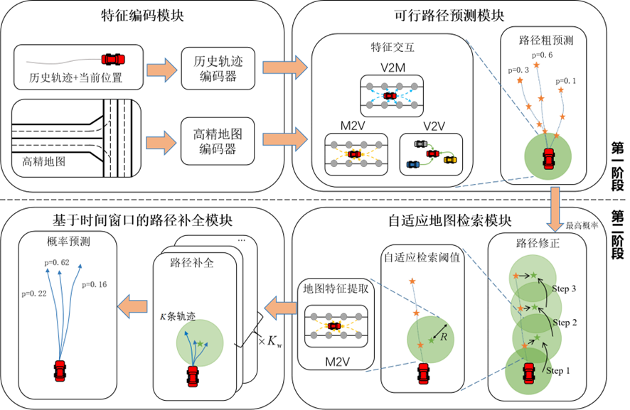

## Two-stage Vehicle Trajectory Prediction Method Based on Adaptive Map Retrieval(TAMR)

## Running
python train.py -m TAMR

python test.py -m TAMR  --weight=/absolute/path/to/45.000.ckpt --split=test/val

python test1vis.py -m TAMR --weight=/absolute/path/to/45.000.ckpt --split=val

## Visualization

